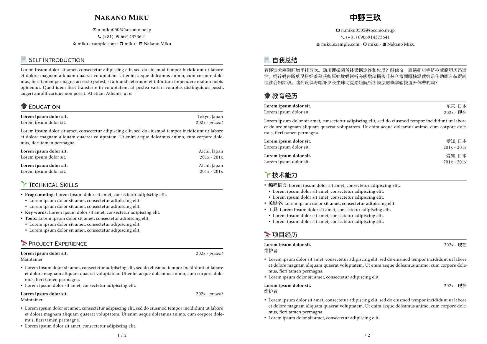
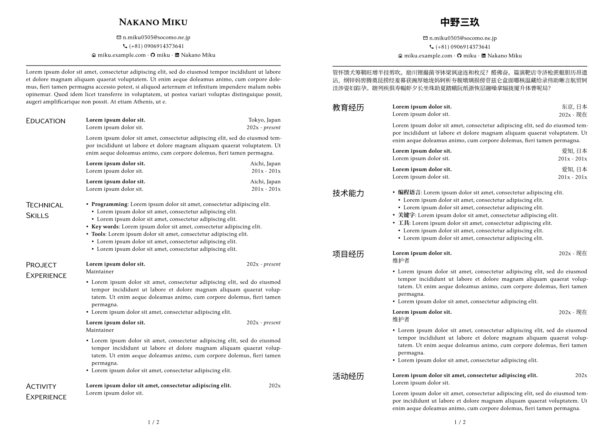

# typst-cv-miku

这是一个简单、优雅、学术风格的 [typst](https://typst.app/) 个人简历（CV）模板。支持中英文（以及更多）。

你可以在 [这里](https://typst.app/project/rbxGsQC-tEkDq0mnNIuxkv) 查看在线演示。

## 示例

## 使用说明

1. 阅读 [typst](https://typst.app/docs/) 文档。
2. 安装此模板需要的字体：
   - [kpfonts](https://ctan.org/pkg/kpfonts)
   - [Source Han Sans](https://github.com/adobe-fonts/source-han-sans)
   - [Source Han Serif](https://source.typekit.com/source-han-serif/cn/)
3. 根据需要修改 `.typ` 文件. 你可能需要了解 typst 的一些基本语法。

## 此外

Typst 目前在 Emoji 输出上有一些 [bugs](https://github.com/typst/typst/issues/144)，所以暂时用 SVG 替代，你可以在 [twemoji utils](https://twemoji.godi.se/) 找到更多。

小图标来自 Material Icons (Community).

## License

Licensed under [WTFPL](http://www.wtfpl.net/).
