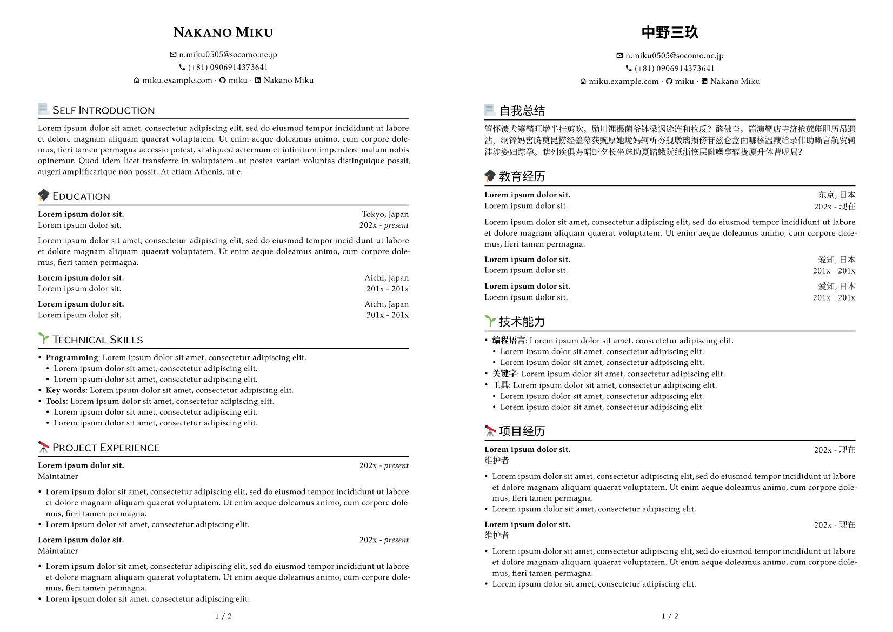

# typst-cv-miku

This is a simple, elegant, academic style CV template for [typst](https://typst.app/). Support for English and Chinese (and more).

You can see the online demo [here](https://typst.app/project/rbxGsQC-tEkDq0mnNIuxkv).

## Showcases

## Usage

1. Read [typst](https://typst.app/docs/) documentation.
2. Install fonts needed by this template：
   - [kpfonts](https://ctan.org/pkg/kpfonts)
   - [Source Han Sans](https://github.com/adobe-fonts/source-han-sans)
   - [Source Han Serif](https://source.typekit.com/source-han-serif/cn/)
3. Modify `.typ` files to fit your needs. You may need to learn some basic typst syntax.

## By the way

Typst currently has some [bugs](https://github.com/typst/typst/issues/144) in the emoji output, so for the time being SVG images are being used instead, which you can find at [twemoji utils](https://twemoji.godi.se/).

Small icon from Material Icons (Community).

## License

Licensed under [WTFPL](http://www.wtfpl.net/).
